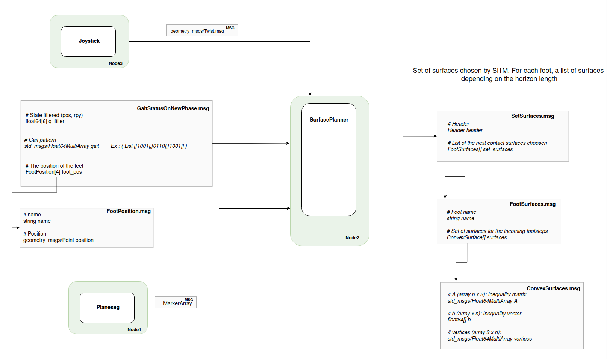

# memmo_planner_ros

Repository containing the ROS node for the SL1M surface planner :
--> SurfacePlanner (Sl1M) node.
--> Surface
--> Joystick controller.


---
## Installation

To use with ps4 controller. --> Generate Twist geometry message for the reference velocity.
```
# Memmo Teleop
$ sudo pip3 install ds4drv
```

---
## Run

SurfacePlanner node :
```
roslaunch surface_planner_ros surface_planner.launch
```

Joystick:
```
# (Joystick)
sudo ds4drv
roslaunch memmo_teleop memmo_teleop_joystick.launch
# (Keyboard)
rosrun memmo_teleop memmo_teleop_keyboard
```

---
## Message type details




##### Implementation details of the surface planner node:

- Use the config file surface_planner_sim.launch to modify the parameters of SL1M.

- Wait for a whole-body message. The robot should be with the 4 feet on the ground. --> This allow to extract the height of the ground + the position/orienation in the world (usefull if the environment is loaded using .stl mesh + allow to add a surface below the robot at any time if using planeseg)

- Wait for the MPC to send the parameters. (type of gait, time spent in double support phase, number of surfaces to return, etc...)

- Subscriber to receive the data from planeseg library, post-process done inside the subscriber.

- Subscriber to receive the velocity command.

- Subscriber to receive the information from the MPC manager (gait status, state filtered, next target of the feet). This should arrive at each new phase of contact. SL1M runs for the whole flying phase and then published the results before the end of the flying phase. At each beginning of the flying phase, get the surface to use from the previous optimisation.

- Timer waiting for a GaitStatusOnNewPhase message to start an optimisation.

- Publisher for visualization.

- Publisher of SetSurfaces containing the surfaces chosen by Sl1m.


---
## Prerequisites
- Ubuntu 20.04
- https://github.com/thomascbrs/memmo_anymal
- [rosdep](http://wiki.ros.org/rosdep)
- [vcstool](http://wiki.ros.org/vcstool)
